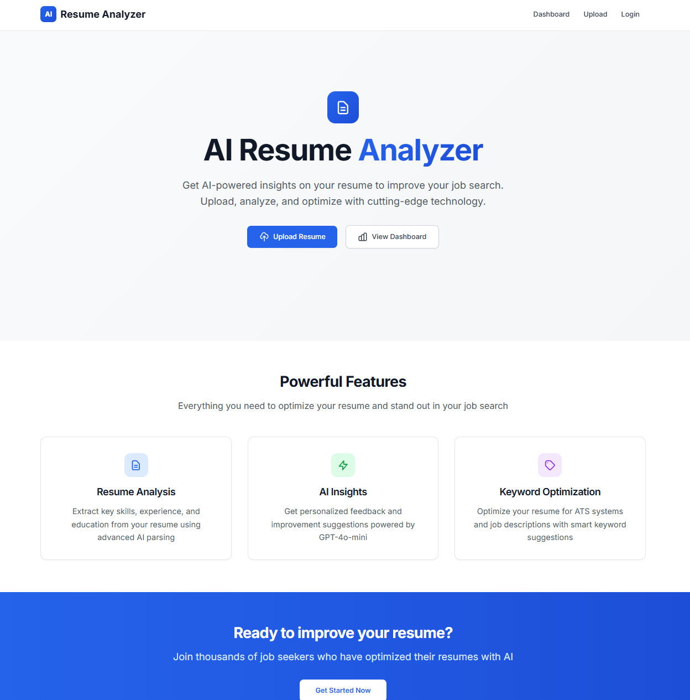

# 🧠 AI Resume Analyzer

A **modern AI-powered SaaS** for analyzing resumes with **dynamic scoring (0–100)** and intelligent insights.  
Built with **Next.js 14**, **TypeScript**, and **OpenAI GPT-4o-mini** — fully spec-driven via **OpenSpecs**.

> **v1.1.0 Update:** Added dynamic scoring engine, improved AI analysis prompts, and refined dashboard UI.

---

## ⚡ Quickstart

```bash
git clone https://github.com/EloiRamos/ai-resume-analyzer.git
cd ai-resume-analyzer
npm install
npm run dev
```

Then open [http://localhost:3000](http://localhost:3000) in your browser.

---

## 🎨 Application Interface



*AI Resume Analyzer dashboard displaying dynamic scoring and insights.*

**Example Results**
| Role              | Score      | Highlights                                      |
| ----------------- | ---------- | ----------------------------------------------- |
| 🤖 AI/ML Engineer  | **78/100** | Excellent technical stack and ML experience     |
| 📈 Project Manager | **82/100** | Strong leadership and business domain knowledge |

---

## ✨ Key Features

- 🎨 **Modern UI/UX** – Clean Tailwind-powered design with responsive layout  
- 📄 **Smart Upload** – Drag-and-drop PDF/DOCX uploads with validation  
- 🤖 **AI Resume Analysis** – GPT-4o-mini driven insights and scoring  
- 📊 **Interactive Dashboard** – Real-time metrics and analytics  
- 🔐 **Authentication-Ready** – NextAuth.js compatible login flow  
- ⚡ **Fast & Reliable** – Optimized performance and error handling  
- 📋 **Spec-Driven Architecture** – Uses OpenSpecs for reproducible development

---

## 🧩 Tech Stack

- **Frontend:** Next.js 14 + TypeScript + React 18  
- **Styling:** Tailwind CSS + custom design system  
- **AI:** OpenAI GPT-4o-mini via OpenAI API  
- **File Handling:** PDF/DOCX parsing  
- **Auth:** NextAuth.js-ready configuration  
- **Deployment:** Optimized for Vercel

---

## ⚙️ Getting Started

### Prerequisites
- Node.js 18+  
- OpenAI API key  

### Installation

```bash
git clone https://github.com/EloiRamos/ai-resume-analyzer.git
cd ai-resume-analyzer
npm install
```

### Environment Variables

Create `.env.local`:
```env
OPENAI_API_KEY=sk-your-key-here
NEXTAUTH_SECRET=<your-random-secret>
NEXTAUTH_URL=http://localhost:3000
```

Generate a secret:
```bash
node -e "console.log(require('crypto').randomBytes(32).toString('hex'))"
```

### Run Locally

```bash
npm run dev
```

Then visit [http://localhost:3000](http://localhost:3000)

---

## 🧪 Usage

| Command         | Purpose                 |
| --------------- | ----------------------- |
| `npm run dev`   | Start dev server        |
| `npm run build` | Build for production    |
| `npm run start` | Start production server |

### Testing Endpoints

- `POST /api/upload` → Upload resume  
- `POST /api/analyze` → Analyze resume  
- `GET /api/dashboard` → Dashboard metrics  

---

## 🤖 AI Scoring System

| Score Range | Description                                                |
| ----------- | ---------------------------------------------------------- |
| 90–100      | Excellent – Outstanding formatting, skills, and experience |
| 80–89       | Good – Strong with minor improvements                      |
| 70–79       | Fair – Decent but needs optimization                       |
| 60–69       | Poor – Missing structure or keywords                       |
| 0–59        | Very Poor – Major issues or missing sections               |

**Analysis Dimensions**
- Skills & relevance  
- Experience quality  
- Education & certifications  
- ATS optimization  
- Strengths & weaknesses  
- Keyword optimization  

---

## 🧱 Project Structure

```
ai-resume-analyzer/
├── app/
│   ├── api/
│   │   ├── analyze/
│   │   │   └── route.ts
│   │   ├── upload/
│   │   │   └── route.ts
│   │   └── auth/
│   │       └── route.ts
│   ├── layout.tsx
│   └── page.tsx
├── components/
│   ├── ui/
│   │   └── Button.tsx
│   └── ResumeCard.tsx
├── openspec/
│   └── specs/
│       ├── project.md
│       ├── features.md
│       └── api.md
├── .kilocode/
│   └── workflows/
│       ├── openspec-apply.md
│       ├── openspec-archive.md
│       └── openspec-proposal.md
├── package.json
├── tsconfig.json
└── .env.local
```

---

## 📘 OpenSpecs Integration

This project uses **OpenSpecs** as a single source of truth for API and feature definitions  
(`openspec/specs/` → `project.md`, `features.md`, `api.md`).

Developers can:
- Update specs → Regenerate scaffold → Sync codebase  
- Keep architecture consistent across teams  

### Optional: Code Generation with Code-Supernova

If you have Code-Supernova installed:

```bash
npm run supernova
```

- Reads `openspec/specs/*.md`  
- Updates routes, components, and API endpoints  
- Keeps code synchronized with specs  

> Optional workflow: Edit specs → `npm run supernova` → `npm run dev`

---

## 🚀 Deployment

### Vercel (Recommended)

1. Push to GitHub  
2. Connect repo in [Vercel Dashboard](https://vercel.com)  
3. Add environment variables  
4. Deploy 🎉 

> Compatible with other Node.js hosts too.

---

## 🤝 Contributing

1. Fork the repository  
2. Create a feature branch  
3. Implement and test your changes  
4. Submit a pull request  

---

## 🧾 Changelog

### v1.1.0
- 🔧 Dynamic scoring bug fixed  
- 🤖 Enhanced AI prompt engineering  
- 🎨 Improved dashboard UI  
- ⚡ Robust error handling  
- 🪶 Updated docs  

### v1.0.0
- Initial release with resume analysis and dashboard  

---

## 📄 License

MIT License © 2025   
See [LICENSE](LICENSE) for details.

---

## 💬 Support

For questions or feedback, please open a GitHub issue.

